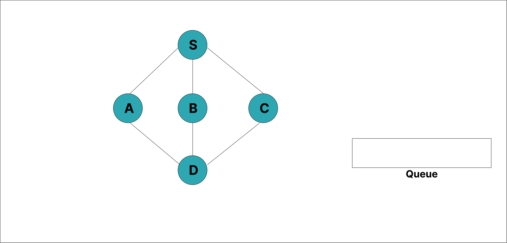
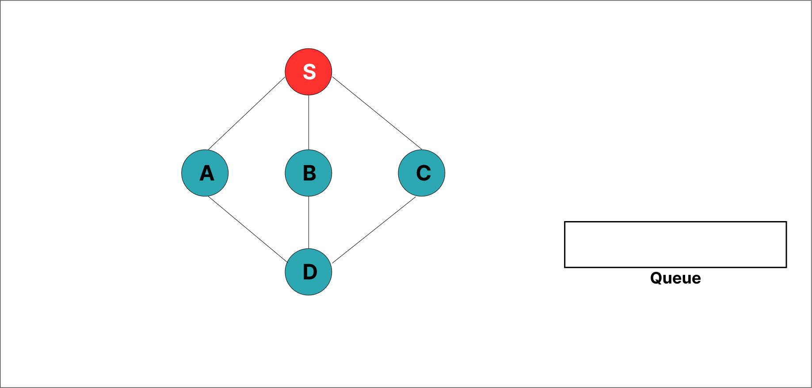
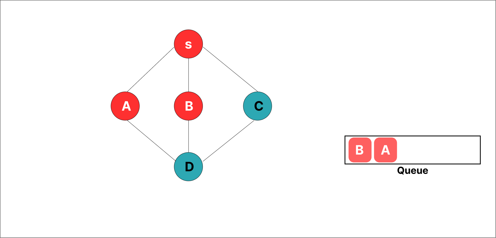

### Breadth First Search Algorithm

##### Starts at some an arbitrary node of a graph and explores the neighbour node first before moving to the next level neighbours.Used for graphs without loop.All edges have same weight or no weight.

<ol>
<li> Take an Empty Queue.</li>
<li> Select a starting node (visiting a node) and insert (enqueue) it into the Queue.</li>
<li>Provided that the Queue is not empty, extract the node from the Queue and insert its child nodes  into the Queue.</li>
<li>Add extracted node to the path </li>
</ol>  

## Example 

 Initialize the queue.

Start from visiting S (starting node), and mark it as visited.

Get all  unvisited adjacent node from S Choose A, mark it as visited and enqueue it.

The unvisited adjacent node from S is B. Mark it as visited and enqueue it.

The unvisited adjacent node from S is C. We mark it as visited and enqueue it.

S is left with no unvisited adjacent nodes. So, we dequeue and find A.

From A we have D as unvisited adjacent node. We mark it as visited and enqueue it.

<b>Breadth First Search: S A B C D</b>
